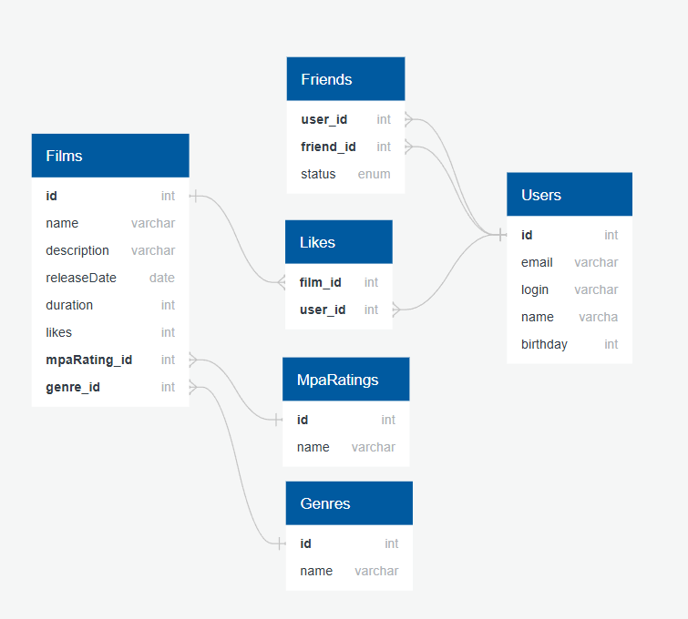

# Схема базы данных для сервиса оценки фильмов

Ниже представлена схема базы данных, которая используется в приложении для хранения информации о фильмах, пользователях, их оценках и отношениях.

 

## Описание таблиц

*   **`Users`**: Хранит данные пользователей (логин, email, день рождения).
*   **`Films`**: Содержит информацию о фильмах (название, описание, дата выпуска, продолжительность).
*   **`MpaRatings`**: Справочник рейтингов Ассоциации кинокомпаний (G, PG, PG-13, R, NC-17).
*   **`Genres`**: Справочник жанров фильмов (Комедия, Драма, Боевик и т.д.).
*   **`Film_Genres`**: Связующая таблица для организации связи "многие-ко-многим" между фильмами и жанрами (один фильм может принадлежать к нескольким жанрам, и в одном жанре может быть много фильмов).
*   **`Likes`**: Фиксирует лайки пользователей (связь между пользователями и фильмами).
*   **`Friends`**: Управляет дружескими связями между пользователями со статусом подтверждения.

